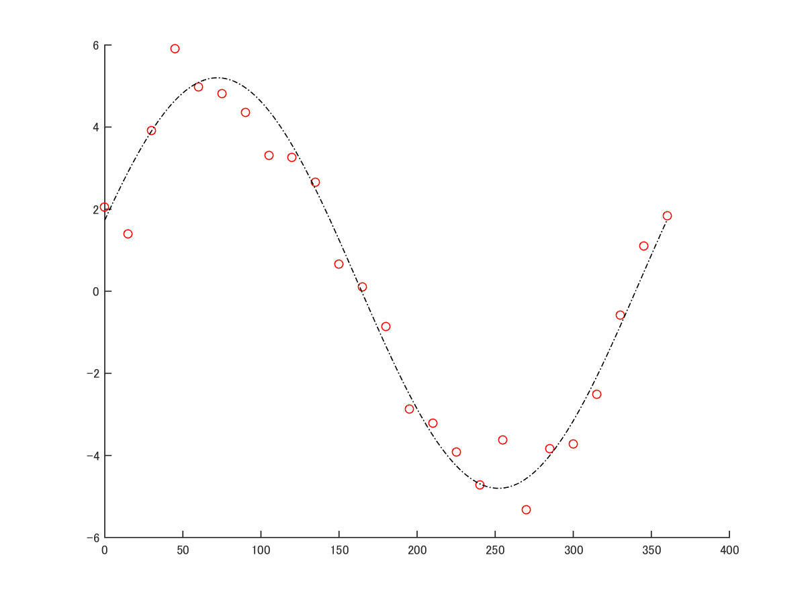
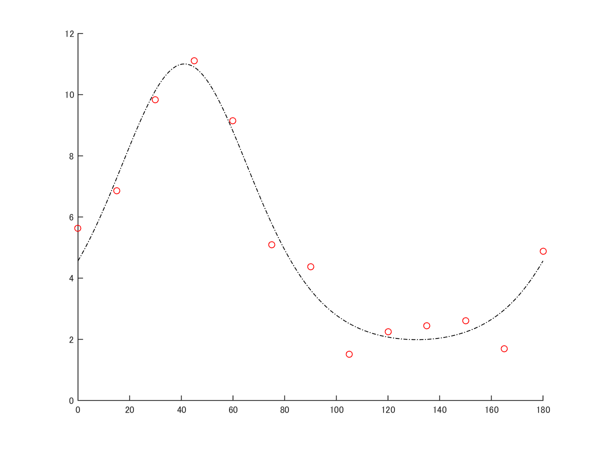

# TuningCurveFitter
library for major fitting function for neuroscience with MATLAB

# functions

## Circular functions
 - FitSin: sin function
 
 - FitCorcGauss: circular gaussian function (VonMises)
 
 .
 .
 .

# Usage
See help doc of each functions

# Contribute
I really welcome your sending new function or bug report
 -  
